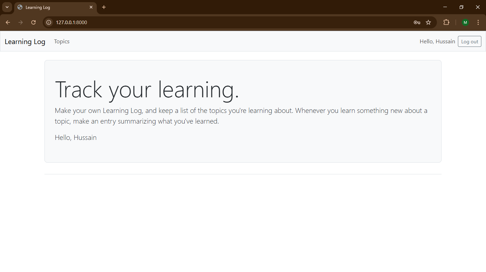

# Learning Log - Track Your Knowledge Journey 📚



A Django-based web application for logging and organizing learning topics and entries. Built as part of [*Python Crash Course*](https://nostarch.com/pythoncrashcourse2e) by Eric Matthes.

---

## Features ✨
- **User Authentication**: Sign up, log in, and manage your private topics/entries.
- **CRUD Operations**: Create, read, update, and delete topics and journal entries.
- **Topic Organization**: Categorize learning subjects (e.g., "Python", "Machine Learning").
- **Simple UI**: Clean interface for focused journaling.

## Tech Stack 💻
- **Backend**: Django 5.1, SQLite (Development)
- **Frontend**: HTML, Django-Bootstrap5, Django Templates
- **Authentication**: Django’s built-in `User` model

## Installation 🛠️
1. Clone the repository:
   ```bash
   git clone https://github.com/hussain-jawaid/learning-logs
   live demo https://stormy-cove-56665-fd33d1ade514.herokuapp.com
